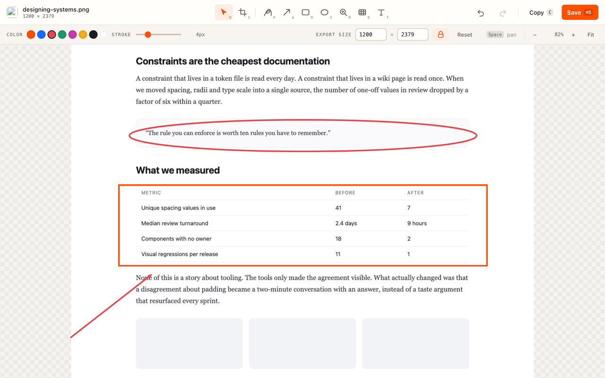
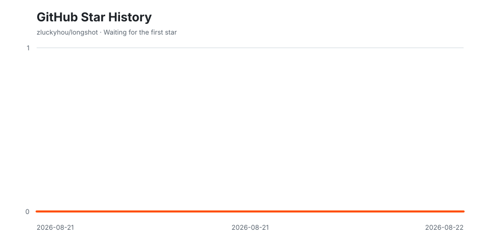

<div align="center">


# Longshot

**One click, the whole page.** Capture a full-page scrolling screenshot in Chrome,
then crop, annotate, mask, magnify, save, or copy it. Nothing leaves the machine.

[](https://github.com/zluckyhou/longshot/actions/workflows/validate.yml)
[](LICENSE)
[](PRIVACY.md)

<a href="https://ko-fi.com/J3J3YMOKZ"></a>

</div>



## Install (unpacked)

1. Open `chrome://extensions`
2. Turn on **Developer mode**
3. **Load unpacked** → select this folder
4. Pin Longshot, open any page, click it — or press <kbd>Alt</kbd>+<kbd>Shift</kbd>+<kbd>S</kbd>

Requires Chrome 116+ (`chrome.runtime.getContexts`).

## Language

The UI follows the browser's language: Simplified Chinese gets `zh_CN`, everything
else falls back to English (`_locales/en` is `default_locale`). Nothing to
configure.

## How a capture works

```
popup ──LS_START──▶ background (service worker)
                      │
                      ├── scripting.executeScript ──▶ content.js
                      │      find what scrolls, unpin sticky, hide fixed, step it
                      │
                      ├── tabs.captureVisibleTab  ── one PNG per screen
                      │
                      ├── runtime.sendMessage ────▶ offscreen.js
                      │      draw each segment at its true scroll offset
                      │      canvas.toBlob → blob: URL
                      │
                      └── tabs.create ────────────▶ editor.html
```

Four details carry most of the quality:

- **The document is not always what scrolls.** SPAs, mail clients and dashboards
  routinely pin `<body>` and scroll an inner container; `window.scrollTo` does
  nothing there, which reads to the user as "it only captured what I could see".
  Longshot uses the document when it genuinely scrolls, and otherwise drives the
  scrollable element that dominates the viewport, cropping each screen to that
  element's rectangle.
- **Segments are drawn at their real scroll offset**, not appended end to end. The
  final screen usually overlaps the previous one (the page can't scroll past its
  bottom); painting by offset makes that overlap self-correcting instead of a bug.
- **`position: sticky` is demoted to `static`** for the run, so a sticky nav appears
  once where it belongs in the flow rather than riding down the whole image.
- **`position: fixed` chrome is kept for screen 1 and hidden afterwards**, so a
  floating header shows up once instead of being stamped on every screen.

Stitching happens in an offscreen document because a service worker has no canvas
and can't mint `blob:` URLs. Segments are drawn as they arrive and freed
immediately, so memory stays flat regardless of page length.

## Settings

| Setting | Default | Notes |
|---|---|---|
| Format | PNG | JPEG exposes a quality slider |
| Wait per screen | 220 ms | Time each screen gets to finish drawing before it is captured. Raise it on animated or slow pages, lower it to go faster. |
| Fixed headers once | on | Off = fixed chrome on every screen |
| Unpin sticky elements | on | Off = sticky bars repeat |
| Pre-scroll lazy images | on | Slower, but nothing renders blank |
| When done | Open editor | Or save the file straight to `Downloads/Longshot/` |

## Colours

The palette is FixedShot's Zapier theme, ported value for value from
`FixedShot/Sources/FixedShot/DesignTokens.swift` — accent `#FF4F00` on canvas
`#FFFEFB`, ink `#201515`, surface `#F8F4F0`, radii 12/12/6. The editor's ink
swatches are FixedShot's eight presets in the same order, so an annotation drawn
in one tool matches one drawn in the other, and the two app icons are siblings:
accent tile, cream stroke-only glyph, round caps.

## The editor

Captures open in a tab instead of landing in Downloads. Nothing is written to disk
until you ask for it.

| Key | Tool | | Key | Action |
|---|---|---|---|---|
| `V` | Select / move / resize | | `C` or `⌘C` | Copy image to clipboard |
| `X` | Crop | | `⌘S` | Save PNG |
| `P` | Draw | | `⌘Z` / `⌘⇧Z` | Undo / redo |
| `A` | Arrow | | `Delete` | Delete selection |
| `R` | Rectangle | | `Esc` | Deselect, then back to Select |
| `O` | Ellipse | | `⌘0` | Fit to window |
| `M` | Magnifier | | `Space`+drag | Pan the canvas |
| `B` | Mask (pixelate) | | `Shift`+draw | Constrain to a square/circle |
| `T` | Text | | `⌘`+wheel | Zoom |

**Magnifier** draws a loupe into the image: the pixels under it are redrawn
enlarged so a detail stays readable. It is an annotation, not a preview — drag it,
resize it, change its power, and it exports with everything else.

**Export size** rescales the output without touching the annotations; the lock
keeps the aspect ratio. **Crop** narrows what is exported and resets the size.

## Permissions

| Permission | Why |
|---|---|
| `activeTab` | Read + capture only the tab you explicitly invoke on. No host permissions, so Longshot cannot see any page you don't point it at. |
| `scripting` | Inject the measuring/scrolling script into that tab |
| `downloads` | Write the finished image, when you ask it to |
| `storage` | Remember your settings |
| `offscreen` | Host the stitching canvas |
| `clipboardWrite` | The editor's copy command |

## Known limits

- **Chrome throttles `captureVisibleTab`** to roughly two calls per second. Longshot
  captures at full speed and backs off only when Chrome refuses, but a very long
  page still takes a while.
- **The tab must stay in front.** `captureVisibleTab` reads whatever is visible, so
  switching tabs aborts the capture rather than producing a corrupted image.
- **One scroller.** The dominant scrollable region is captured; a page with two
  independently scrolling panes captures only the larger one.
- **Horizontal scroll isn't stitched** — output is the page at its current width.
- **Very tall pages get scaled down** to fit Chrome's canvas limits (32767 px per
  side, 2^28 px total). The popup says so when it happens.
- `chrome://`, the Web Store, and `file://` (without the file-access opt-in) are
  blocked by Chrome, not by Longshot.

## Layout

```
manifest.json
_locales/{en,zh_CN}/messages.json
src/
  background.js   run orchestration, capture, editor handoff, download
  content.js      scroller detection, measurement, sticky/fixed handling
  offscreen.js    canvas stitching, blob export
  editor.*        the annotation editor
  popup.*         the capture panel
  theme.css       shared tokens + bundled faces
  i18n.js
fonts/            Space Grotesk + JetBrains Mono, latin, OFL
icons/            generated by scripts/icon.mjs
```

Regenerate icons after changing the mark:

```bash
node scripts/icon.mjs
```

## Contributing

Bug reports, capture edge cases, translations, and focused pull requests are
welcome. Read [CONTRIBUTING.md](CONTRIBUTING.md) before getting started and use
the existing issue templates when reporting a problem.

Please report suspected vulnerabilities privately according to
[SECURITY.md](SECURITY.md), and follow the [Code of Conduct](CODE_OF_CONDUCT.md)
in all project spaces.

## Privacy

Longshot has no server, account, analytics, or host permissions. Capture,
stitching, editing, and export happen locally in the browser. Read the full
policy in [English](PRIVACY.md) or [简体中文](PRIVACY.zh-CN.md).

## Star history

The chart is generated inside this repository by a scheduled GitHub Action. It
uses the repository-scoped `GITHUB_TOKEN`; no personal access token or star data
is sent to a third-party chart service.



## License

Longshot is open source under the [MIT License](LICENSE).
